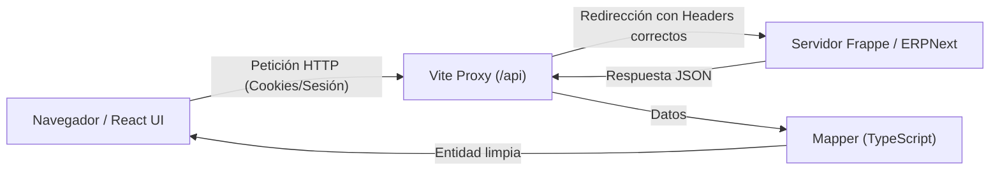

# Frappe Frontend Dashboard

Un panel de administración moderno, rápido y modular construido con **React 19**, **Tailwind CSS v4** y **TypeScript**, diseñado para conectarse y consumir como backend el ecosistema de **Frappe Framework** / **ERPNext**.

---

## 📌 Tabla de Contenidos

1. [¿De qué trata este proyecto?](#-de-qué-trata-este-proyecto)
2. [Tecnologías Utilizadas](#-tecnologías-utilizadas)
3. [¿Cómo se conecta y consume Frappe?](#-cómo-se-conecta-y-consume-frappe)
4. [Arquitectura del Proyecto](#-arquitectura-del-proyecto)
5. [Requisitos Previos](#-requisitos-previos)
6. [Instalación y Puesta en Marcha](#-instalación-y-puesta-en-marcha)
7. [Scripts Disponibles](#-scripts-disponibles)
8. [Flujo para Agregar Nuevas Funcionalidades](#-flujo-para-agregar-nuevas-funcionalidades)

---

## 💡 ¿De qué trata este proyecto?

**Frappe** es un framework web backend en Python muy potente (el motor detrás de **ERPNext**), que cuenta con base de datos, autenticación, permisos y un sistema de modelos llamado **DocTypes**.

Este proyecto es un **Frontend independiente (Single Page Application)** que reemplaza o complementa la interfaz clásica de Frappe con una experiencia de usuario moderna, basada en componentes reutilizables, modo claro/oscuro y gráficos interactivos.

---

## 🛠️ Tecnologías Utilizadas

El proyecto fue diseñado con herramientas modernas para maximizar la velocidad de desarrollo, el rendimiento y la facilidad de mantenimiento:

| Tecnología                          | Rol en el Proyecto                                                                              |
| :---------------------------------- | :---------------------------------------------------------------------------------------------- |
| **React 19**                        | Biblioteca principal para construir la interfaz mediante componentes.                           |
| **TypeScript**                      | Añade tipado estático para prevenir errores y mejorar el autocompletado.                        |
| **Vite**                            | Herramienta de compilación ultrarrápida para desarrollo y empaquetado final.                    |
| **Tailwind CSS v4**                 | Framework de estilos utilitarios moderno para un diseño responsivo y limpio.                    |
| **TanStack Query (React Query v5)** | Manejo de peticiones al servidor, caché inteligente y revalidación de datos en segundo plano.   |
| **Zustand**                         | Manejador de estado global liviano y directo (controla la sesión del usuario autenticado).      |
| **Axios**                           | Cliente HTTP configurado para interactuar con la API REST de Frappe enviando cookies de sesión. |
| **Frappe React SDK**                | Librería complementaria con utilidades y hooks adaptados a Frappe.                              |
| **React Router v7**                 | Gestión de navegación del lado del cliente, con rutas públicas y privadas (protegidas).         |
| **ApexCharts & Flatpickr**          | Visualización de gráficos estadísticos y selectores interactivos de fechas.                     |

---

## ¿Cómo se conecta y consume Frappe?

Frappe ofrece automáticamente una **API REST** para cualquier entidad (DocType) y métodos remotos de servidor. El frontend se comunica con él de la siguiente manera:



### 1. Proxy Inverso en Desarrollo (Solución a CORS)

En desarrollo local, para evitar problemas de CORS (_Cross-Origin Resource Sharing_) y que las cookies se compartan sin fricción, Vite está configurado con un **proxy inverso** (`vite.config.ts`):

- Cualquier llamada a `/api/*`, `/files/*` o `/private/*` se redirige automáticamente al servidor backend de Frappe.
- El proxy inyecta encabezados clave que Frappe necesita, como `Host`, `Origin` y `X-Frappe-Site-Name`.

### 2. Autenticación Basada en Sesión y Cookies

- **Login**: Se envía una solicitud `POST` a `/api/method/login` con `usr` (correo) y `pwd` (contraseña).
- **Manejo de Cookies**: Axios está configurado con `withCredentials: true` (`src/api/frappeApi.ts`). Al iniciar sesión exitosamente, Frappe asigna una cookie de sesión (`sid`) que el navegador guarda y envía automáticamente en las siguientes peticiones.
- **Sesión Persistente y Verificación**:
  - Al cargar la aplicación, se consulta el método `/api/method/frappe.auth.get_logged_user`.
  - Si el usuario está autenticado, se consulta su perfil detallado en `/api/resource/User/{email}`.
  - Si la sesión expiró o devuelve código `401`, un interceptor de Axios invalida automáticamente el estado para pedir reautenticación.

### 3. Consumo de DocTypes (API REST estándar de Frappe)

Para interactuar con cualquier tabla o modelo de Frappe:

- **Listar registros:** `GET /api/resource/{DocType}`
- **Consultar un registro:** `GET /api/resource/{DocType}/{nombre_o_id}`
- **Crear un registro:** `POST /api/resource/{DocType}`
- **Actualizar un registro:** `PUT /api/resource/{DocType}/{nombre_o_id}`
- **Eliminar un registro:** `DELETE /api/resource/{DocType}/{nombre_o_id}`

### 4. Transformación de Datos (Mappers)

Para evitar que el código de los componentes dependa de nombres internos de campos de Frappe (ej. `first_name`, `desk_theme`, etc.), se utilizan **Mappers** (como `UserMapper.frappeToEntity`) que transforman el formato de Frappe a objetos limpios de TypeScript para el frontend.

---

## 🏛️ Arquitectura del Proyecto

El código está organizado de forma modular para que sea intuitivo de entender y fácil de escalar:

```text
src/
├── actions/             # Funciones de consumo API (login, get-current-user, update-user)
├── api/                 # Configuración de Axios (frappeApi) e interceptores
├── components/          # Componentes visuales reutilizables (botones, modales, formularios, tablas)
├── context/             # Proveedores de contexto de React (tema claro/oscuro, etc.)
├── hooks/               # Custom hooks de React (useModal, etc.)
├── icons/               # Iconos SVG organizados y optimizados con SVGR
├── infrastructure/      # Capa de datos y adaptación:
│   ├── core/            # Entidades e interfaces del dominio de la aplicación
│   ├── interfaces/      # Interfaces que reflejan la respuesta cruda de la API de Frappe
│   ├── mappers/         # Funciones de transformación (de formato Frappe a entidad interna)
│   └── utils/           # Utilidades avanzadas (ej. seeder de datos de prueba)
├── layout/              # Estructura principal de la app (Sidebar, Header, Layout general)
├── pages/               # Pantallas completas de la aplicación:
│   ├── auth/            # Iniciar sesión, Registro
│   ├── dashboard/       # Tableros principales y métricas
│   ├── profile/         # Perfil de usuario con actualización en tiempo real
│   ├── tables/          # Vistas de tablas de datos
│   └── ...              # Otras vistas (formularios, calendarios, etc.)
├── stores/              # Estados globales con Zustand (useAuthStore)
├── app.router.tsx       # Configuración de rutas (rutas protegidas vs públicas)
├── FrappeFrontend.tsx   # Configuración de Providers (QueryClient, FrappeProvider, AuthCheck)
└── main.tsx             # Punto de entrada de la aplicación
```

---

## 📋 Requisitos Previos

Antes de comenzar, asegúrate de contar con:

- **Node.js**: Versión `20.x` o superior recomendada (mínimo `18.x`).
- **Gestor de paquetes**: Se recomienda **pnpm** (el proyecto incluye configuración y bloqueos optimizados para pnpm), aunque también puedes usar `npm` o `yarn`.
- **Servidor Frappe / ERPNext**: Una instancia en ejecución (local o en la nube) con usuarios creados.

---

## 🚀 Instalación y Puesta en Marcha

Sigue estos sencillos pasos para levantar el proyecto en tu entorno local:

### 1. Clonar el repositorio

```bash
git clone <URL_DEL_REPOSITORIO>
cd frappe-frontend
```

### 2. Instalar dependencias

Usando **pnpm** (recomendado):

```bash
pnpm install
```

_(O si prefieres npm: `npm install`)_

### 3. Configurar variables de entorno

Copia el archivo de ejemplo para crear tu `.env`:

```bash
cp .env.example .env
```

Contenido básico de `.env`:

```env
# URL base que utilizará el frontend (en desarrollo apunta al proxy local de Vite)
VITE_API_URL=http://localhost:5173

# Opcional: Credenciales si utilizas tokens en lugar de sesión por cookies
VITE_FRAPPE_API_KEY=
VITE_FRAPPE_API_SECRET=
```

> ⚙️ **¿Quieres cambiar el servidor de Frappe al que te conectas?**  
> Abre el archivo `vite.config.ts` y modifica la propiedad `target` dentro de `server.proxy['/api']` con la URL de tu servidor Frappe:
>
> ```ts
> '/api': {
>   target: 'https://tu-servidor-frappe.com',
>   changeOrigin: true,
>   ...
> }
> ```

### 4. Iniciar el servidor de desarrollo

```bash
pnpm dev
```

La aplicación estará disponible de inmediato en:
👉 **`http://localhost:5173`**

### 5. Iniciar Sesión

Ingresa con el correo y la contraseña de cualquier usuario válido registrado en tu instancia de Frappe. Si las credenciales son correctas, el sistema guardará la sesión y te redirigirá automáticamente al Dashboard.

---

## 📜 Scripts Disponibles

En la raíz del proyecto puedes ejecutar:

| Comando        | Descripción                                                                                         |
| :------------- | :-------------------------------------------------------------------------------------------------- |
| `pnpm dev`     | Inicia el servidor de desarrollo con recarga rápida en vivo (_Hot Module Replacement_).             |
| `pnpm build`   | Comprueba tipos con TypeScript y compila los archivos listos para producción en la carpeta `dist/`. |
| `pnpm preview` | Levanta un servidor local para previsualizar la compilación de producción.                          |
| `pnpm lint`    | Analiza el código con ESLint para detectar inconsistencias de estilo o errores.                     |

---

## 🔄 Flujo para Agregar Nuevas Funcionalidades

Si deseas agregar una nueva sección que consuma datos de un DocType de Frappe (por ejemplo, _Customers_ o _Projects_):

1. **Definir Interfaces (`src/infrastructure/interfaces/`)**: Describe los campos que devuelve Frappe para ese DocType.
2. **Definir Modelo Limpio (`src/infrastructure/core/`)**: Define la estructura simplificada que usará tu componente de React.
3. **Crear Mapper (`src/infrastructure/mappers/`)**: Crea una función que transforme la respuesta de Frappe al modelo limpio.
4. **Crear la Acción (`src/actions/`)**: Crea una función que haga la petición usando `frappeApi.get('/api/resource/NombreDocType')`.
5. **Consumir con React Query (`useQuery`)**: En tu componente o página, usa `useQuery` para obtener y cachear los datos de forma reactiva.

---
